# Payment domain method flows

This is an implementation-backed map of the payment domain. It covers the
exported helpers in `internal/domain/payment.go` and the public operational
methods on `internal/service/payments.go` that create, settle, or maintain a
payment. Amounts are integer kobo.

The request referred to `ENGINEERING-SERVICEs.md`; that file is not in this
checkout. The authoritative sources used here are the Go implementation,
tests, store layer, and `XEGO_PAYMENT_DIAGRAMS.md`.

## Payment lifecycle

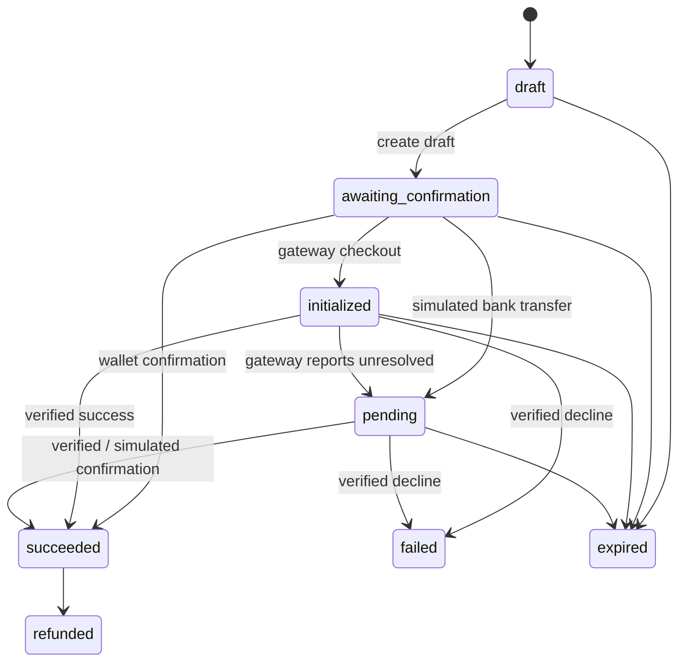

## Domain helpers (`internal/domain/payment.go`)

### `CanTransition`

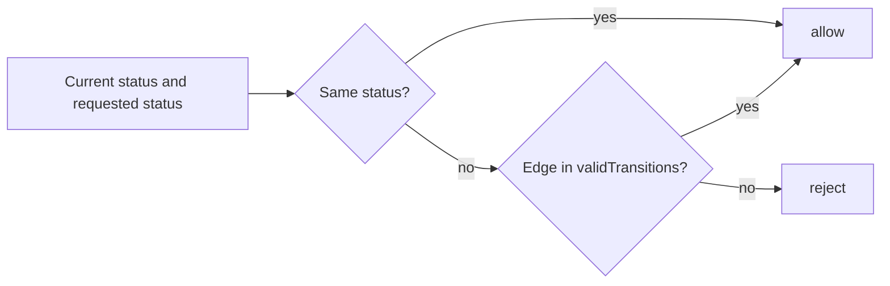

### `ParseNGNAmount`

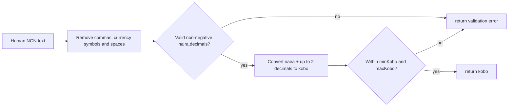

### `FormatNGN`

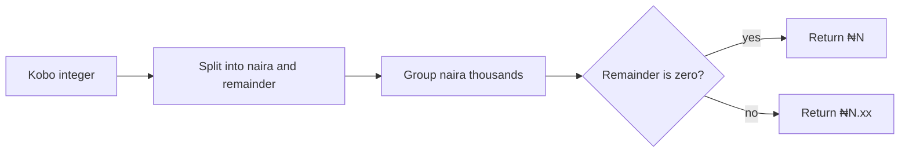

### `NewProviderReference`

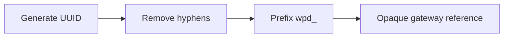

### `NewReceiptToken` and `NewCheckoutToken`

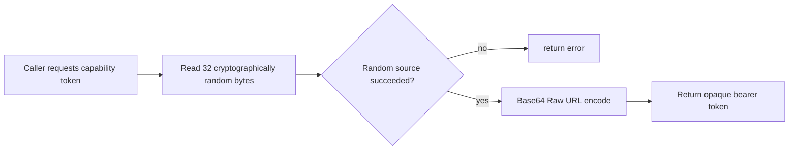

### `CanonicalE164Phone`

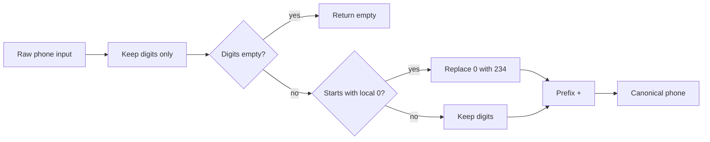

## Payment creation and checkout

### `CreateDraft`, `CreateDraftForProvider`, and `CreateCollectionDraft`

`CreateDraft` is the convenience card/WhatsApp collection path. The other two
delegate to the same core; collection drafts add the Xego fee, while
provider-specific drafts charge the supplied amount exactly.

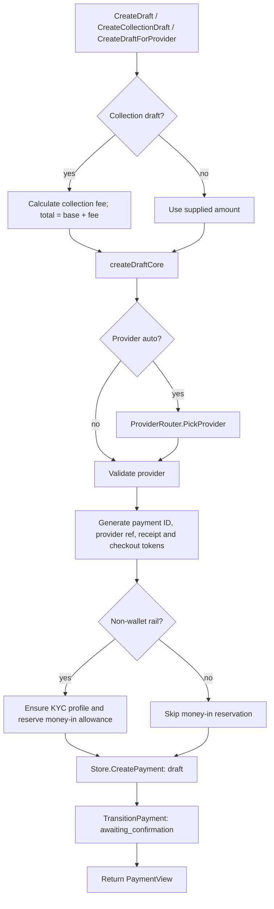

### `CreateWalletTopupDraft`

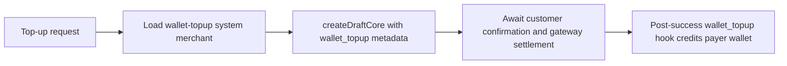

### `CreateCheckout` and `ResolveCheckout`

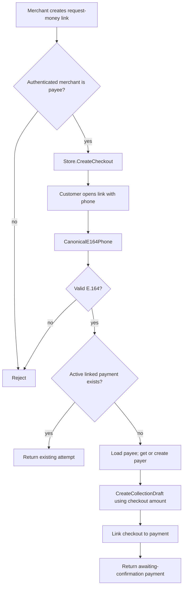

### `HostedCheckoutURL` and `InitializeCheckout`

```mermaid
flowchart LR
    A[Awaiting-confirmation payment] --> B[HostedCheckoutURL builds /checkout/{token}]
    B --> C[Customer explicitly confirms]
    C --> D{Gateway configured for provider?}
    D -- no --> X[Return error]
    D -- yes --> E[Gateway.Initialize with reference, amount, callback and metadata]
    E --> F{Returned reference matches?}
    F -- no --> X
    F -- yes --> G[Store.SetCheckout URL]
    G --> H[Payment is initialized]
```

## Rail-specific confirmation

### `ConfirmWalletPayment`

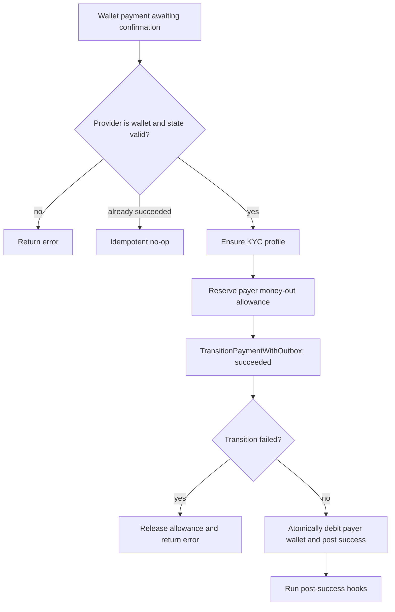

### `InitializeBankTransferSimulation` and `ConfirmBankTransferSimulation`

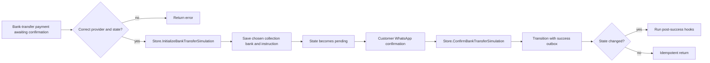

### `CreateIndividualPayDraft` and individual-pay settlement

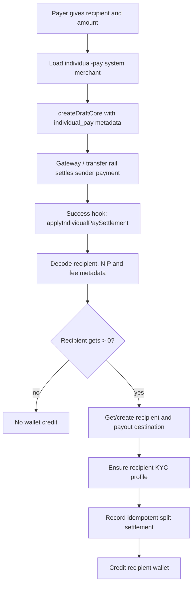

## Authoritative gateway settlement

### `VerifyAndApply`

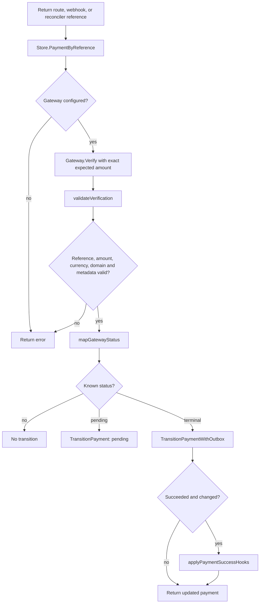

`ValidateWebhook` in the Interswitch adapter validates the HMAC-SHA512
signature, but a webhook remains only a signal. `VerifyAndApply` performs the
signed server-side requery before value is delivered.

## Post-success processing

### `applyPaymentSuccessHooks`, `runPaymentHook`, and `ApplyPendingPaymentHooks`

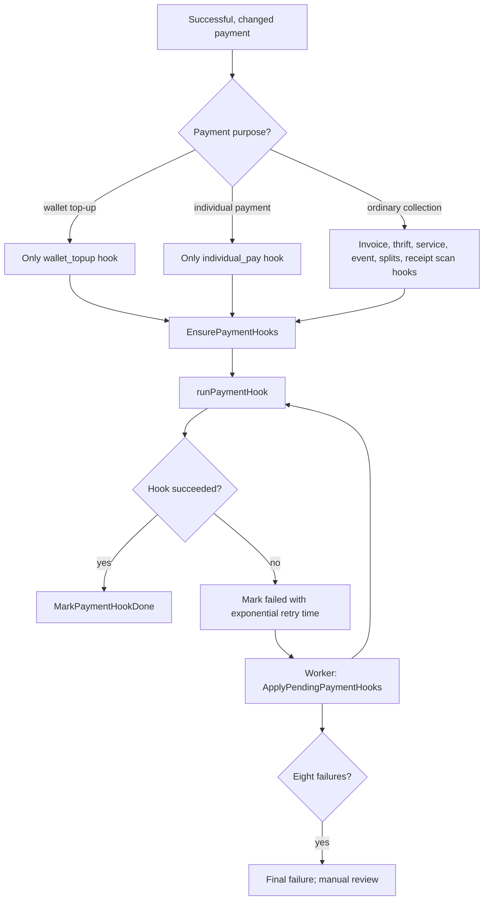

### `applyCollectionSplits` and `collectionSplitAmounts`

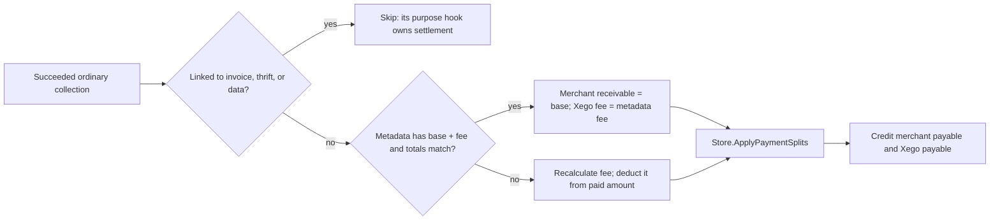

### `createReceiptScanToken` and `NotifyMerchantPayment`

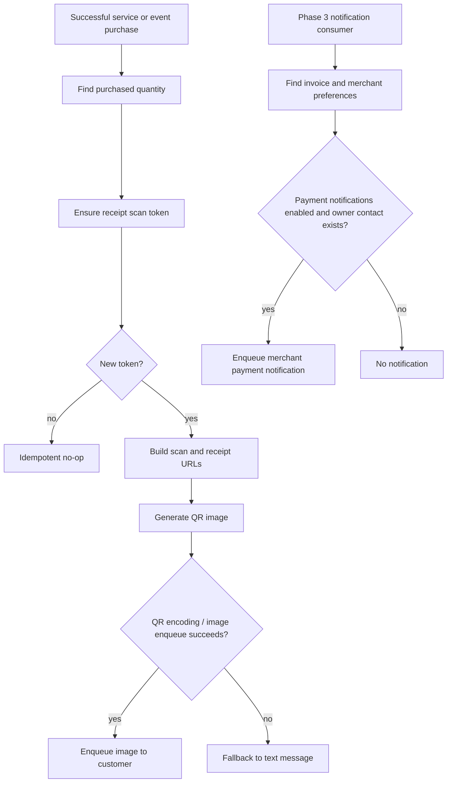

## Operational methods

### `Reconcile` and expiration

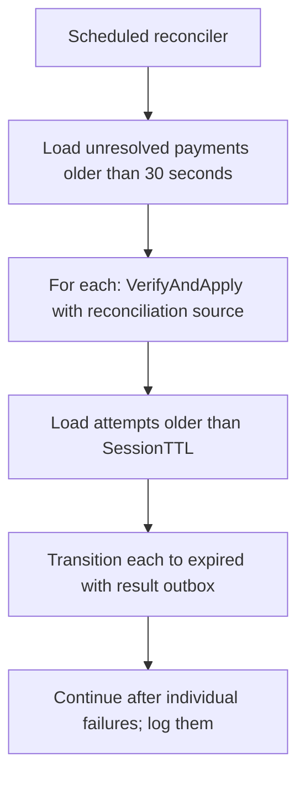

### `ProviderList` and `IsGatewaySuccessEvent`

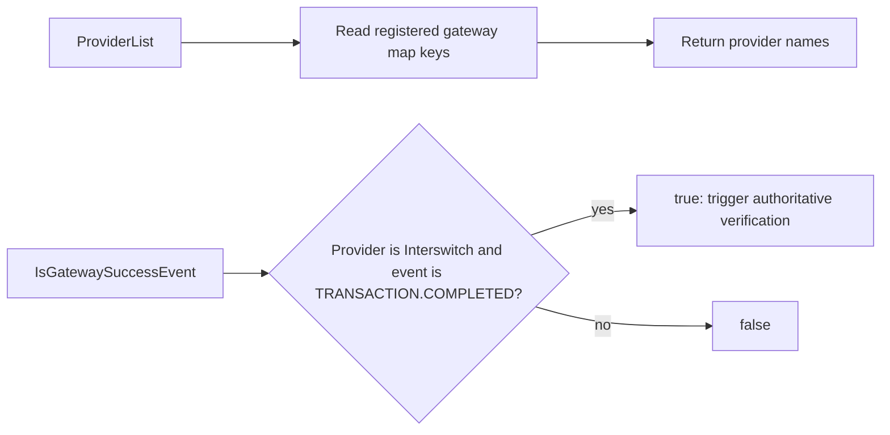

## Invariants to retain when changing the domain

- Only `VerifyAndApply`, wallet confirmation, and the explicit simulated bank
  confirmation can move a payment to `succeeded`.
- Gateway redirects and webhooks never establish success on their own;
  server-side verification does.
- Payment transitions and customer result notifications are persisted together
  through the outbox path for terminal outcomes.
- Allowance reservations are reference-keyed and must be released when a
  non-wallet attempt becomes terminal without succeeding.
- Hooks are post-commit, idempotent, and retried; a hook failure must not undo
  a successful payment transition.
