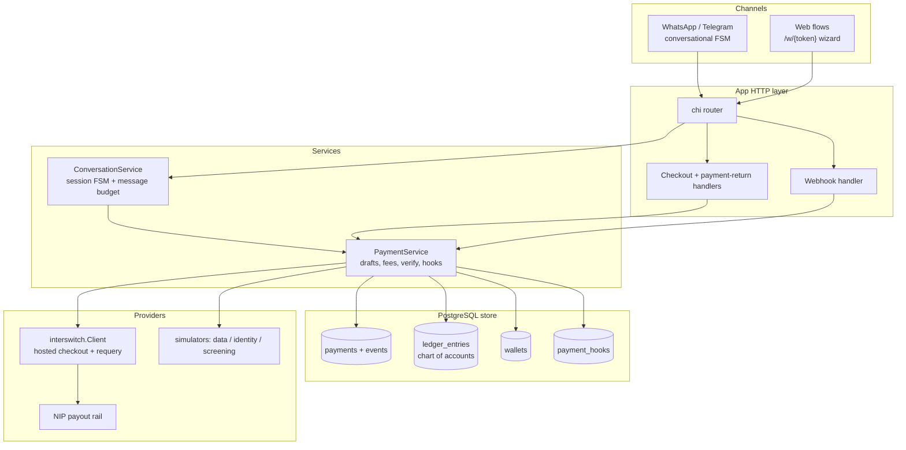
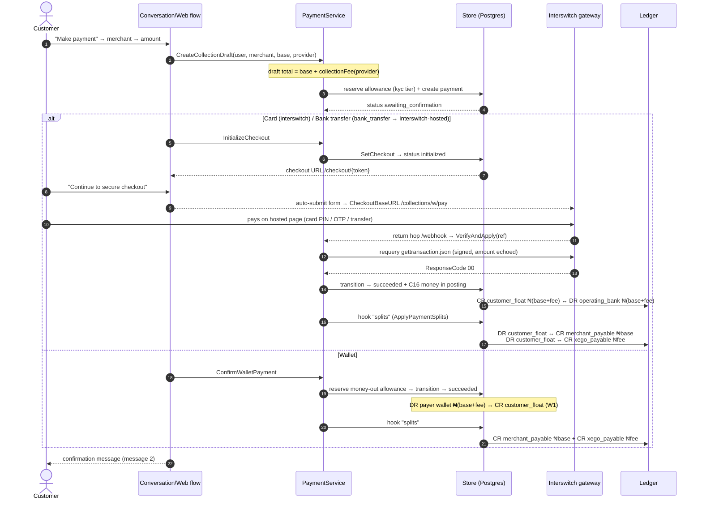
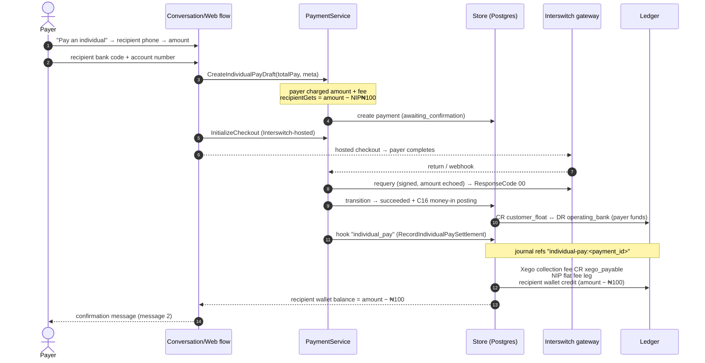
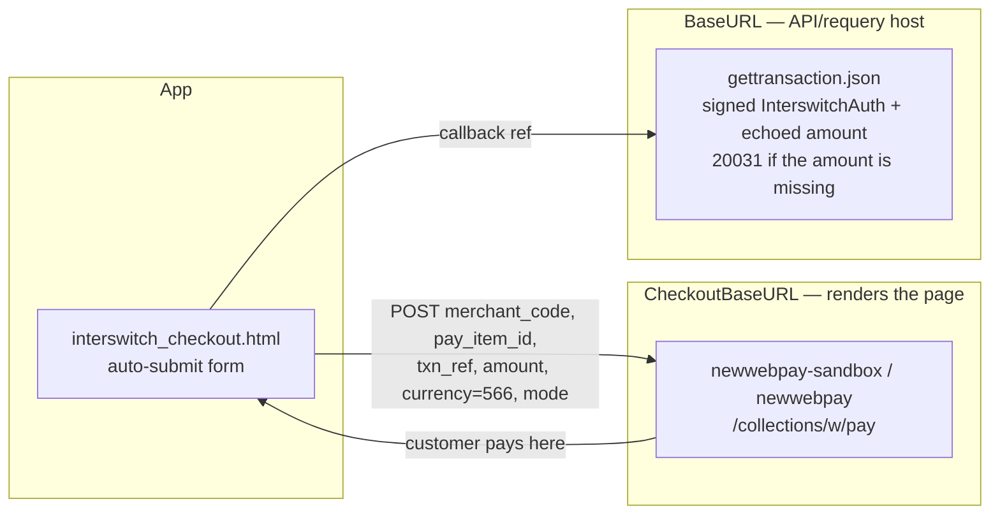
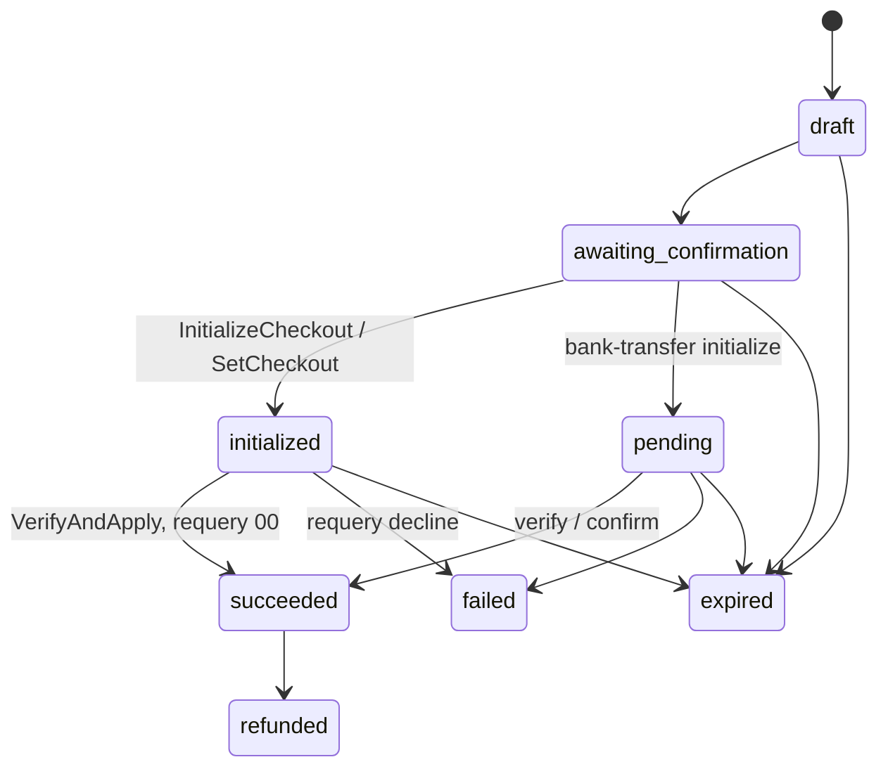
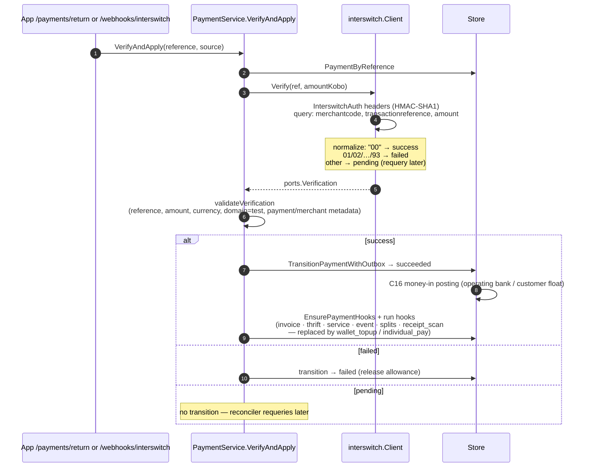

# Xego — Payment Engineering Diagrams

Mermaid diagrams for the three payment surfaces: **merchant payment methods**,
**P2P (individual) transfers**, and the **payment gateway**. Every label maps
to a real symbol in `internal/service`, `internal/store`, `internal/app`, and
`internal/providers/interswitch`. Render with any Mermaid viewer (GitHub,
VS Code + Markdown Preview Mermaid, or `npx @mermaid-js/mermaid-cli`).

Amounts are integer **kobo** (₦1 = 100 kobo). Fees come from
`service/fees.go`; ledger postings from `store/store_payments.go`
(transitionPayment) and `store/store_split_payments.go`.

---

## 1. System component overview

---

## 2. Merchant payment methods ("Make payment")

One payment, three rails. The **provider** picks the fee channel
(`FeeChannelForProvider`) and the ledger flavor of money-in:

| Rail | Provider | Fee channel | Money-in posting |
|---|---|---|---|
| Card | `interswitch` | `card` | DR operating bank / CR customer float |
| Bank transfer | `bank_transfer` (Interswitch-hosted) | `dva` | same as card |
| Wallet | `wallet` | `card` | DR **payer wallet** / CR customer float (W1) |

Collection fee = `min(amount × bps/10000 + fixed, cap)`, never more than the
amount. Card defaults: 200 bps + ₦100 fixed, capped ₦3,500. DVA/bank:
150 bps, capped ₦1,500.

Worked example (card, base ₦2,500): fee = `250000×200/10000 + 10000` =
₦150 → customer charged **₦2,650**, merchant payable ₦2,500, Xego payable
₦150, books net to zero.

---

## 3. P2P transfer ("Pay an individual")

Payer sends to a recipient **bank account**; money lands in the recipient's
Xego wallet (in-platform until cash-out). Payer is charged `amount +
collectionFee` (transfer channel: 180 bps, cap ₦2,500); a flat **NIP fee
₦100** is deducted from the payout, so the recipient wallet gets
`amount − ₦100`.

Worked example (₦5,000, verified live in simulation): collection fee
`500000×180/10000` = ₦90 → payer charged **₦5,090**; NIP ₦100; recipient
wallet credited **₦4,900**; ledger nets to zero.

---

## 4. Payment gateway

### 4.1 Host split (why the checkout host differs from the API host)

`interswitch.Options` carries two bases after the 2026 fix: the form posts to
**`CheckoutBaseURL`** (default per mode: `newwebpay-sandbox…` TEST /
`newwebpay…` LIVE — the hosts that actually render the payment page), while
requery/webhook traffic stays on **`BaseURL`** (the API host that answers
signed `gettransaction.json`: `sandbox.interswitchng.com` TEST /
`webpay.interswitchng.com` LIVE).

### 4.2 Payment lifecycle (state machine)

`domain.CanTransition` monotonic edges (`internal/domain/payment.go`):

### 4.3 Confirmation pipeline

The only path that marks a payment successful is `PaymentService.VerifyAndApply`
(never the client-side redirect): signed requery → guard checks → outbox
transition → C16 money-in → idempotent post-success hooks.

Webhooks are authenticated separately: Interswitch signs the raw JSON body
with HMAC-SHA512 using the dashboard webhook secret
(`Client.ValidateWebhook`); a webhook is only a *signal* — the authoritative
outcome always comes from the requery above.
